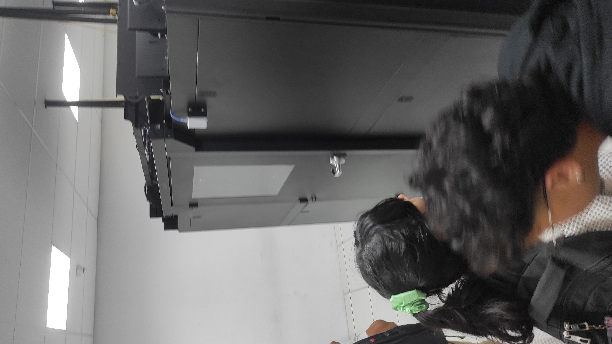
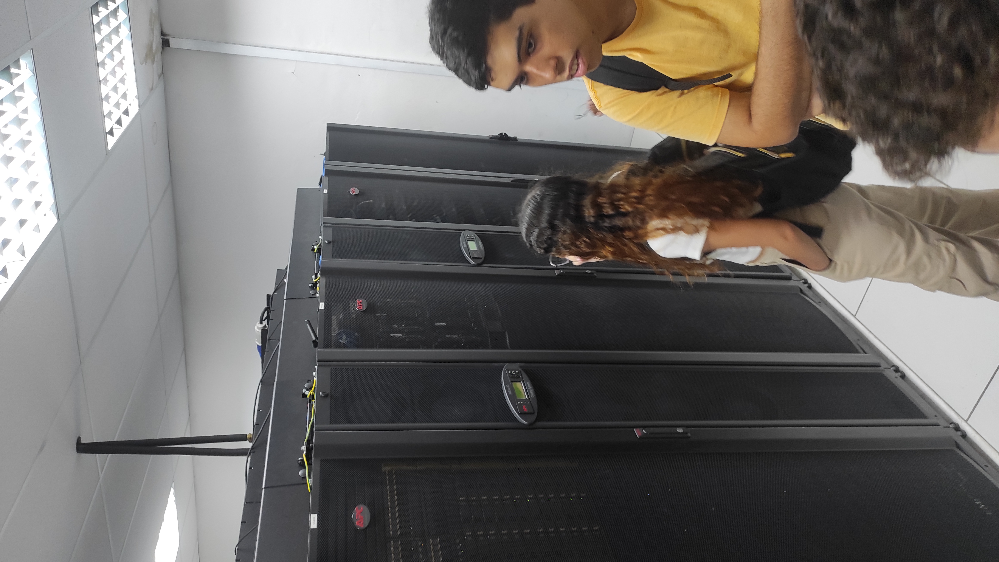

# Relatório de visita

## Informações gerais
- **Disciplina**: Sistemas Operacionais (SO) do curso de TADS (Superior em Tecnologia em Análise e Desenvolvimento de Sistemas) no CNAT-IFRN (Instituto Federal de Educação, Ciência e Tecnologia do Rio Grande do Norte - Campus Natal-Central).
- **professor**: [Leonardo A. Minora](https://github.com/leonardo-minora)
- **Local da visita técnica**: Datacenter do IFRN
- **Aluno**: [Lucas Pinheiro da Costa](https://github.com/lucas-pinheiro-costa) (mat. 20231014040023)

## Introdução

### O que é o IFRN?

O Instituto Federal de Educação, Ciência e Tecnologia do Rio Grande do Norte (IFRN) é uma instituição pública de ensino reconhecida por sua excelência na oferta de educação profissional, científica e tecnológica. Fundado em 1909, o IFRN possui campi em diversas cidades do estado, promovendo acesso à educação de qualidade e contribuindo para o desenvolvimento regional.

Oferece cursos técnicos, graduações, pós-graduações e programas de extensão e pesquisa, alinhados às demandas do mercado e à inovação. Sua estrutura inclui laboratórios modernos, bibliotecas e projetos que integram ensino, pesquisa e extensão, com foco em áreas como tecnologia, engenharias, meio ambiente, gestão e ciências humanas.

O IFRN destaca-se por seu compromisso com a inclusão social, a sustentabilidade e a formação cidadã, preparando profissionais qualificados e críticos. Além disso, é referência em projetos de inovação e parcerias com setores público e privado, fortalecendo a relação entre academia e sociedade.

Com uma equipe de docentes e técnicos altamente capacitados, o IFRN consolida-se como um dos principais pilares da educação profissional e tecnológica no Brasil, transformando vidas e impulsionando o desenvolvimento do Rio Grande do Norte.

 

### O que é um datacenter?

Um datacenter é uma instalação física projetada para abrigar sistemas computacionais e componentes associados, como servidores, dispositivos de armazenamento, equipamentos de rede e sistemas de telecomunicações. Esses centros são essenciais para armazenar, processar e distribuir grandes volumes de dados, garantindo que aplicações e serviços funcionem de maneira eficiente e segura.

**Principais características de um datacenter:**

1. Infraestrutura de TI:

    * **Servidores**: Máquinas que processam e gerenciam dados.
    * **Armazenamento**: Sistemas como discos rígidos, SSDs ou soluções em nuvem para guardar dados.
    * **Redes**: Equipamentos como switches, roteadores e cabos que permitem a comunicação entre dispositivos e a conexão com a internet.

1. Infraestrutura física:

    * **Refrigeração**: Sistemas de ar condicionado e resfriamento para manter a temperatura ideal e evitar superaquecimento.
    * **Energia**: Fontes de alimentação ininterrupta (UPS), geradores e sistemas redundantes para garantir energia constante.
    * **Segurança física**: Controle de acesso, câmeras de vigilância, biometria e outras medidas para proteger os equipamentos.

1. Conectividade:

    * Alta largura de banda e conexões de rede robustas para garantir a transferência rápida e confiável de dados.

1. Escalabilidade:

    * Capacidade de expandir a infraestrutura conforme a demanda por processamento e armazenamento aumenta.

1. Redundância e confiabilidade:

    * Sistemas redundantes de energia, rede e armazenamento para minimizar falhas e garantir disponibilidade contínua.

**Tipos de datacenters:**

1. **Enterprise datacenters**: Operados por empresas para suas próprias necessidades.
1. **Colocation datacenters**: Instalações onde várias empresas alugam espaço para seus equipamentos.
1. **Cloud datacenters**: Operados por provedores de nuvem (como AWS, Google Cloud ou Microsoft Azure) para oferecer serviços escaláveis.
1. **Edge datacenters**: Pequenas instalações localizadas próximas aos usuários finais para reduzir a latência.

A evolução tecnológica tem levado os datacenters a adotarem soluções mais avançadas, como virtualização e computação em nuvem, permitindo uma utilização mais eficiente dos recursos e atendendo às crescentes demandas por processamento e armazenamento de dados.

Em resumo, os datacenters são fundamentais para o funcionamento das operações de TI nas organizações modernas, suportando desde aplicações internas até serviços complexos baseados na web, garantindo disponibilidade, segurança e eficiência no gerenciamento de informações críticas.

 

### Qual o motivo da visita?

Conhecer o datacenter do IFRN oferece benefícios significativos para estudantes, técnicos, gestores e pesquisadores, permitindo uma visão prática da infraestrutura de TI da instituição. Para alunos de Tecnologia da Informação e Comunicação (TIC), a experiência proporciona aprendizado sobre redes, armazenamento, segurança e virtualização, facilitando a aplicação dos conceitos teóricos.

O datacenter garante segurança, confiabilidade e continuidade dos serviços acadêmicos e administrativos, protegendo dados sensíveis e oferecendo suporte a plataformas de ensino a distância, pesquisa e inovação. Além disso, possibilita o desenvolvimento de habilidades profissionais e promove a integração com redes de pesquisa como a RNP.

A infraestrutura é projetada para eficiência energética e escalabilidade, otimizando o uso de recursos e reduzindo custos. Para gestores, conhecer o datacenter auxilia na transparência e governança, permitindo decisões estratégicas sobre investimentos e modernização tecnológica.

Por fim, a visita ao datacenter fortalece a resiliência institucional, garantindo backup e recuperação de desastres e alinhando a infraestrutura de TI às necessidades acadêmicas. Essa experiência prepara os envolvidos para os desafios do setor, impulsionando a inovação e a melhoria dos serviços educacionais do IFRN.

 

## Descrevendo a visita

A visita ao **datacenter do IFRN** no Campus Natal Central permitiu uma visão detalhada sobre sua infraestrutura, monitoramento e segurança. A rede utilizada é fornecida pela **Rede Nacional de Ensino e Pesquisa (RNP)**, garantindo **99% de eficácia na conexão**. Para maior resiliência, há um **link secundário de internet**, semelhante ao utilizado em redes domiciliares, que assegura o funcionamento de serviços essenciais em caso de falha da conexão principal.

O monitoramento do desempenho da rede e dos equipamentos é realizado por meio da ferramenta **Zabbix**, que fornece dados precisos sobre o funcionamento dos sistemas. O **dashboard de monitoramento** permite a visualização em tempo real do status da infraestrutura, auxiliando na rápida identificação e solução de problemas. Além disso, **a maior parte da manutenção e do monitoramento ocorre remotamente pela reitoria**, otimizando recursos e reduzindo deslocamentos.

A estrutura física do datacenter conta com um piso elevado, onde passam diversos cabos, facilitando futuras manutenções. Em termos de segurança contra incêndios, **o ambiente é protegido pelo gás FM200**, um sistema de supressão de fogo seguro para equipamentos eletrônicos.

**O datacenter foi implantado no formato de container**, solução considerada a mais adequada para as necessidades do IFRN, proporcionando maior flexibilidade e eficiência na operação. O sistema de **ar-condicionado de precisão** foi escolhido para evitar riscos de alagamento e preservar os equipamentos contra variações de temperatura.

Dentro da estrutura, há um **rack legado**, onde ficam equipamentos mais antigos que podem ser substituídos ou descartados futuramente. Já os **closers** são áreas que abrigam as máquinas responsáveis pela operação do datacenter. A presença de múltiplos closers garante o funcionamento contínuo, mesmo em situações críticas, como falhas técnicas ou mecânicas.

A visita ao datacenter destacou a importância da infraestrutura moderna e segura para garantir a operação ininterrupta dos serviços do IFRN, demonstrando como a tecnologia e boas práticas são aplicadas para manter a eficiência e a confiabilidade da instituição.

 

## Considerações finais
O que foi aprendido na visita?

A visita ao datacenter do IFRN – Campus Natal Central permitiu compreender sua infraestrutura avançada, monitoramento e segurança. Aprendemos sobre a rede provida pela RNP, que garante 99% de eficácia, e o link secundário para serviços essenciais. O monitoramento via Zabbix e o dashboard otimizam a gestão remota feita pela reitoria. Observamos o piso elevado para manutenção dos cabos, o gás FM200 contra incêndios e o ar-condicionado de precisão. O datacenter em container foi a solução ideal para o IFRN, e os closers garantem a operação contínua, mesmo em falhas técnicas. A experiência reforçou a importância de uma infraestrutura segura e eficiente.